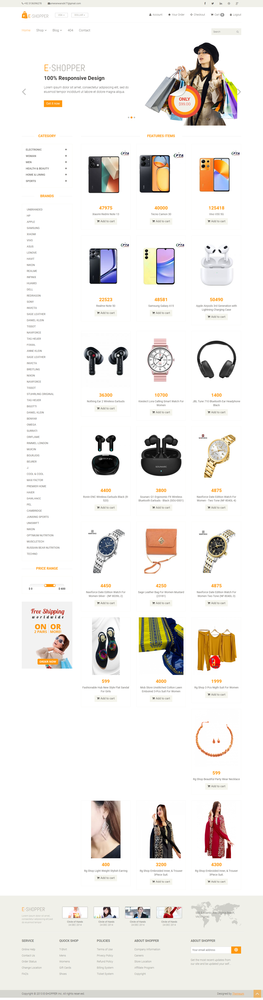
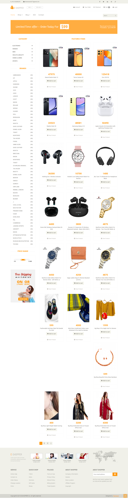
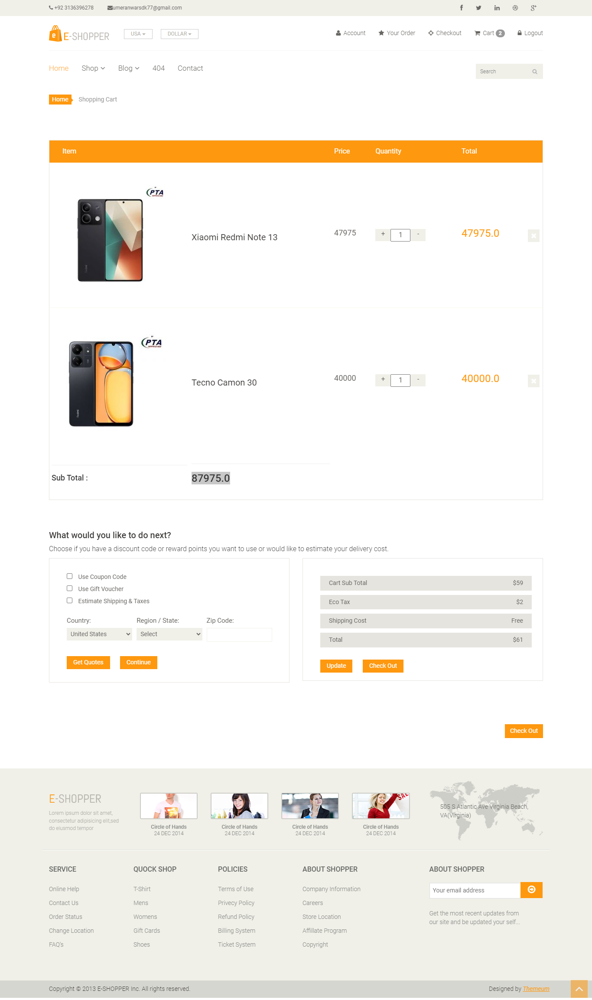
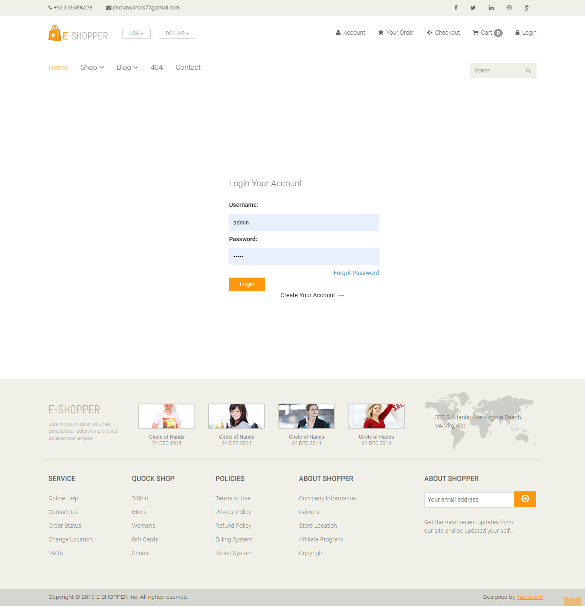
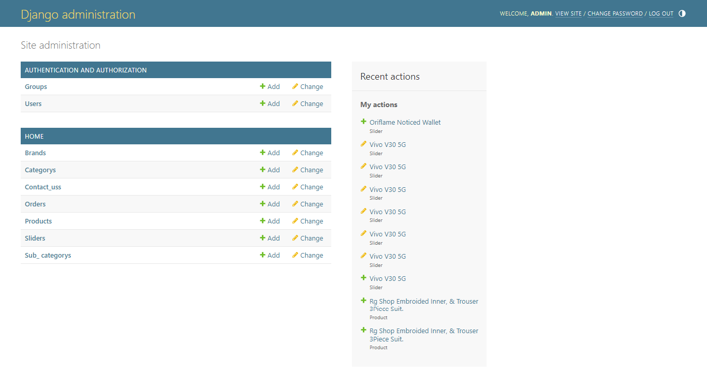

# E-Shopper_Django_Ecommerce

Welcome to my awesome Ecommerce project! This project does amazing things and you're going to love it.

## Features

- Ecommerce
- Shopping Cart Dajngo
- Authentication System
- Django Filter System

## Screenshots

Here are some screenshots of our awesome project:

### Home Page

### Products Page

### Cart Page

### Login Page

### Admin Page

## Installation
Read The (requirements.txt)
To install this project, follow these steps:

1. Clone the repository
2. Install python
3. install django
4. Install django shopping cart
5. install pillow
7. Run the project

